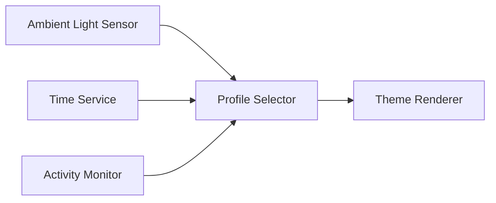

# Adaptive Theme Engine: Environment-Aware Color Management

## Core Architecture Principle

**"Automatically adapts visual presentation to circadian rhythms and ambient conditions while preserving design integrity across all interface elements."**

## Time-Based Profile Matrix

| Profile            | Time Range  | Color Temp | Lighting Characteristics | Suggested Activities       |
| ------------------ | ----------- | ---------- | ------------------------ | -------------------------- |
| `daybreak-soft`    | 06:00–10:00 | 4500K      | Warm morning light       | Waking up, light work      |
| `daylight-neutral` | 10:00–18:00 | 6500K      | Standard daylight        | Focused work, productivity |
| `dusk-dimmed`      | 18:00–22:00 | 3500K      | Reduced evening glow     | Relaxation, media viewing  |
| `midnight-dark`    | 22:00–06:00 | 2400K      | Sleep-friendly tones     | Night use, low stimulation |

## Multi-Factor Adaptation System

### 1. Environmental Integration

```rust
pub struct AmbientConditions {
    pub lux_level: f32,       // Ambient light intensity
    pub color_temp: Option<u16>, // Measured ambient color temp
    pub weather: WeatherCondition,
    pub location: GeoCoordinates,
}
```

### 2. Adaptive Profile Selection

```rust
fn select_profile(state: &SystemState) -> ThemeProfile {
    let base_profile = match state.time.hour() {
        6..=9 => Profile::DaybreakSoft,
        10..=17 => Profile::DaylightNeutral,
        18..=21 => Profile::DuskDimmed,
        _ => Profile::MidnightDark,
    };

    base_profile
        .adjust_for_ambient(state.ambient)
        .adjust_for_activity(state.activity)
        .apply_user_prefs(state.user_settings)
}
```

## Intelligent Adjustments

### 1. Ambient Light Compensation

```glsl
// Fragment shader applying dynamic adjustments
uniform float uAmbientLux;

vec3 adapt_to_environment(vec3 color) {
    float adaptation = clamp(uAmbientLux / 1000.0, 0.5, 1.5);
    return color * adaptation;
}
```

### 2. Activity-Based Modifications

```rust
enum UserActivity {
    FocusWork,
    CreativeWork,
    MediaConsumption,
    NightRest,
}

impl ThemeProfile {
    fn for_activity(activity: UserActivity) -> Self {
        match activity {
            UserActivity::FocusWork => self.with_contrast(1.2),
            UserActivity::MediaConsumption => self.with_dimming(0.8),
            // ...
        }
    }
}
```

## Configuration Interface

### 1. User Preferences

```ron
// ~/.config/ayni/theme_prefs.ron
ThemePreferences (
    base_profiles: {
        "daybreak-soft": (temp: 4500, min_lux: 50),
        "daylight-neutral": (temp: 6500, min_lux: 100),
    },
    overrides: {
        "meeting_mode": (temp_adjust: -500, contrast: 1.1),
        "reading_night": (max_temp: 3000, brightness: 0.7)
    }
)
```

### 2. Automatic Transition Settings

```rust
pub struct TransitionSettings {
    pub duration: Duration,
    pub curve: AnimationCurve,
    pub light_adaptive: bool, // Slower transitions in dark environments
    pub activity_paused: bool, // Pause during fullscreen apps
}
```

## System Integration

### 1. Hardware Sensors



### 2. Power Management

```rust
fn power_aware_adjustment(profile: ThemeProfile, power: PowerState) -> ThemeProfile {
    match power {
        PowerState::Battery => profile.with_energy_saving(),
        PowerState::LowPower => profile.with_reduced_animations(),
        _ => profile,
    }
}
```

## Developer Tools

### 1. Simulation Mode

```bash
theme-simulator \
    --time 19:30 \
    --lux 200 \
    --activity media \
    --output debug.png
```

### 2. Validation Suite

```rust
#[test]
fn test_profile_transitions() {
    let morning = Profile::DaybreakSoft;
    let day = Profile::DaylightNeutral;

    assert_eq!(
        morning.transition_to(day).duration,
        STANDARD_TRANSITION
    );
}
```

This system delivers:

1. **Biologically-aligned** default behaviors
2. **Context-aware** automatic adjustments
3. **Non-disruptive** transitions between states
4. **User-overridable** at every level
5. **Hardware-optimized** performance

The engine maintains visual consistency by:

- Applying all adjustments through centralized shaders
- Enforcing palette constraints during transitions
- Providing fallback states for missing sensor data
- Maintaining accessibility standards across all profiles
