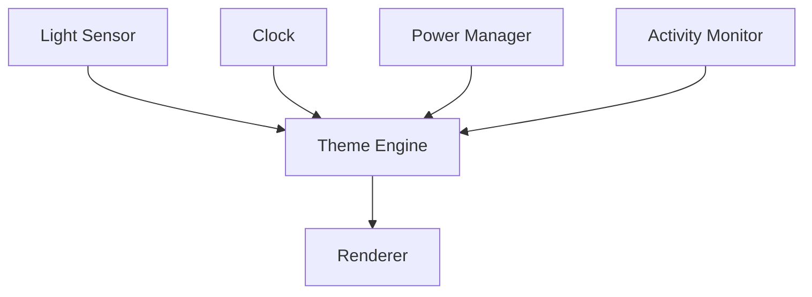

# Adaptive Theming System

**Core Principle**:  
_"Automatically adapt visual presentation to environmental conditions, user activity, and system state while maintaining design consistency and accessibility standards."_

## 1. Core Architecture

### Theme State Structure

```rust
#[derive(State)]
pub struct ThemeState {
    pub base_profile: ThemeProfile,
    pub adjustments: Vec<ThemeAdjustment>,
    pub constraints: ThemeConstraints,
    #[observed]
    pub current: ActiveTheme,
}
```

### Profile Selection System

```rust
fn select_profile(state: &SystemState) -> ThemeProfile {
    let base = match state.time.hour() {
        6..=9 => Profile::DaybreakSoft,
        10..=17 => Profile::DaylightNeutral,
        18..=21 => Profile::DuskDimmed,
        _ => Profile::MidnightDark,
    };

    base.apply_ambient(state.ambient)
        .apply_activity(state.activity)
        .apply_prefs(state.preferences)
}
```

## 2. Environmental Adaptation

### Sensor Integration



### Shader Adjustments

```glsl
uniform float uAmbientLux;
uniform float uColorTemp;

vec3 adapt_theme(vec3 base_color) {
    float adapt_factor = clamp(uAmbientLux/10000.0, 0.7, 1.3);
    vec3 temp_adjusted = apply_temp(base_color, uColorTemp);
    return temp_adjusted * adapt_factor;
}
```

## 3. Profile Definitions

### Built-in Profiles

| Profile            | Color Temp | Brightness | Use Case             |
| ------------------ | ---------- | ---------- | -------------------- |
| `daylight-neutral` | 6500K      | 100%       | Daytime work         |
| `dusk-dimmed`      | 3500K      | 85%        | Evening relaxation   |
| `midnight-dark`    | 2400K      | 70%        | Low-light conditions |
| `accessibility`    | 5000K      | 120%       | High contrast needs  |

## 4. User Configuration

### Preference File Format

```ron
ThemePreferences (
    base_profiles: {
        "work": (temp: 5500, contrast: 1.1),
        "media": (temp: 3400, brightness: 0.8)
    },
    rules: [
        (condition: AfterSunset, action: ApplyProfile("dusk-dimmed")),
        (condition: BatteryLow, action: ReduceAnimations)
    ]
)
```

### DBus API Endpoints

```xml
<interface name="org.desktop.ThemeEngine">
    <method name="SetProfile">
        <arg name="profile" type="s" direction="in"/>
    </method>
    <signal name="ThemeChanged">
        <arg name="new_theme" type="s"/>
    </signal>
</interface>
```

## 5. System Integration

### Power Awareness

```rust
impl ThemeState {
    fn handle_power_change(&mut self, power: PowerState) {
        match power {
            PowerState::Battery => self.set_power_saving(true),
            PowerState::LowPower => self.reduce_animations(),
            _ => self.set_power_saving(false),
        }
    }
}
```

### Card System Integration

[Related: Everything is a Card](../principles/everything-is-a-card.md)

```rust
struct CardTheme {
    base: ThemeProfile,
    overrides: HashMap<CardType, ThemeAdjustments>,
}
```

## Advantages

1. **Physiological Alignment**:

   - Circadian rhythm support
   - Reduced eye strain

2. **Context Awareness**:

   ```rust
   match activity {
       Activity::Reading => profile.with_contrast(1.2),
       Activity::Media => profile.with_dimming(0.8),
       _ => profile
   }
   ```

3. **Performance**:
   - Single shader for all adjustments
   - Hardware-accelerated transitions

## Cross-References

- [Color Palettes](../theming/color-palettes.md)
- [Night Light Rules](../theming/night-light-rules.md)
- [Declarative Shell](../principles/declarative-shell.md)

## Roadmap

1. **Core Features**:

   - Complete sensor integration
   - Animation system

2. **Optimizations**:

   - GPU palette management
   - Predictive adjustments

3. **Tooling**:
   - Theme debugger
   - Profile simulator

This theming system provides automatic, context-aware visual adaptation while maintaining full user control and system-wide consistency.
