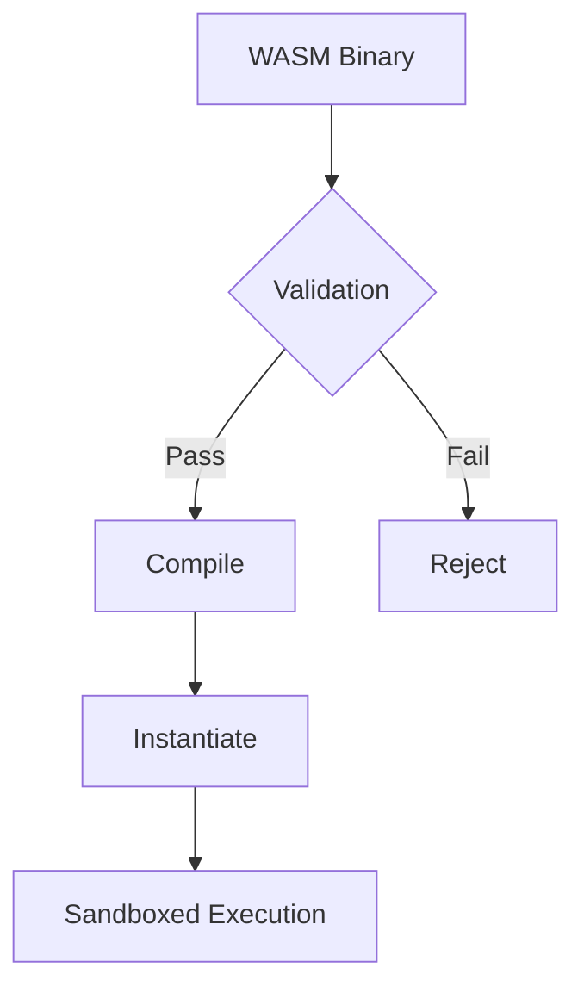

# **Compilation-Free Extensibility**

**Core Principle**:  
_"New functionality is added through self-contained WASM modules with declarative interfaces, enabling real-time system extension without recompilation or downtime."_

## **Technical Implementation**

### **Module Architecture**

```rust
#[derive(Serialize, Deserialize)]
pub struct WasmExtension {
    pub manifest: ExtensionManifest,  // Declarative interface
    pub bytecode: Vec<u8>,           // WASM module
    pub permissions: RuntimeCapabilities,
    pub hot_reload: bool,            // Live replacement
}
```

### **Declarative Interface Example**

```ron
// manifest.ron
ExtensionManifest (
    name: "weather-widget",
    api_version: "0.1",
    exports: {
        "render": (params: [i32, i32], ret: i32),
        "update": (params: [json], ret: bool)
    },
    permissions: {
        network: ["api.weather.com"],
        filesystem: ["read:/var/cache/weather"]
    }
)
```

## **Runtime Integration**

### **Loading Process**



### **Performance-Critical Path**

```rust
struct WasmRuntime {
    store: wasmtime::Store,
    module: wasmtime::Module,
    instance: wasmtime::Instance,
    memory: wasmtime::Memory,
    #[cfg(debug)]
    profiler: WasmProfiler,
}
```

## **Key Features**

### **Hot Reload System**

```bash
# Developer workflow
cargo watch -x "build --target wasm32-wasi && \
    desk ext install ./target/wasm32-wasi/debug/module.wasm"
```

### **Cross-Component Communication**

```rust
fn call_extension(ext: &WasmExtension, method: &str, data: &[u8]) -> Result<Vec<u8>> {
    let func = ext.instance.get_typed_func::<(), i32>(method)?;
    let ptr = write_to_wasm_memory(&ext.memory, data);
    func.call(ptr)?;
    read_from_wasm_memory(&ext.memory, ptr)
}
```

## **Security Model**

### **Capability-Based Permissions**

```ron
permissions: {
    network: [
        "connect:api.github.com:443",
        "listen:127.0.0.1:3000"
    ],
    gpu: "limited:webgl1",
    system: [
        "notify",
        "clipboard:read"
    ]
}
```

### **Runtime Enforcement**

```rust
impl WasmRuntime {
    fn validate_syscall(&self, syscall: Syscall) -> Result<()> {
        if !self.manifest.permissions.allows(&syscall) {
            Err(PermissionDenied(syscall))
        }
        // ...
    }
}
```

## **Developer Tools**

### **Debugging Interface**

```bash
desk ext debug weather-widget --trace-execution
# Output:
# [WASM] Calling render(1024x768)
# [System] Allowed network access to api.weather.com
# [Performance] Execution: 12.4ms
```

### **Version Management**

```bash
desk ext list
# NAME           STATUS    API    PERMISSIONS
# weather-widget Active    0.1    network, gpu
# code-formatter Inactive  0.2    filesystem
```

## **Advantages Over Traditional Systems**

1. **Zero Downtime Updates**:

   ```rust
   fn update_extension(old: WasmExtension, new: WasmExtension) {
       old.instance.terminate();
       new.instantiate();
       state.notify_components();
   }
   ```

2. **Language Agnostic**:

   - Supports Rust, C/C++, Go via WASM targets
   - Future: Python, Ruby through WASI polyfills

3. **Deterministic Behavior**:
   - All WASM modules are pre-validated
   - Strict resource limits enforced

## **Cross-References**

- [Security by Design Principle](#)
- [Card System Integration](#)
- [Rust API Documentation](#)

## **Roadmap**

### **Short-Term**

- WASI preview1 support
- Module signing system

### **Mid-Term**

- On-demand module loading
- Cross-device sync for extensions

### **Long-Term**

- Neural network acceleration hooks
- Quantum-resistant cryptography

This principle transforms the system into a **living architecture** where new capabilities can be safely added post-deployment while maintaining strict security and performance guarantees.
