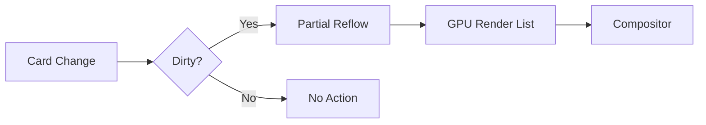

# Everything is a Card: Unified Interface System

**Core Principle**:  
_"All interface elements exist as autonomous, interactive cards following consistent physical metaphors and declarative behavior rules."_

## 1. Core Architecture

### Card Type System

```rust
#[derive(State, Serialize, Deserialize)]
pub struct Card {
    pub id: Uuid,
    pub content_type: CardContent,  // App, Media, Widget, Terminal
    pub behavior: CardBehavior,     // Drag, Stack, Flip permissions
    #[observed]
    pub state: CardState,          // Active/Focused/Minimized
    #[serde(skip)]
    pub renderer: CardRenderer,
}
```

### Content Variants

```rust
enum CardContent {
    App(AppDescriptor),
    Media(MediaMetadata),
    Terminal(TerminalSession),
    Widget(WidgetManifest),
    Container(CardGroup),
}
```

## 2. Interaction Model

### Gesture Mapping

| Physical Metaphor | Digital Implementation | Resulting Behavior |
| ----------------- | ---------------------- | ------------------ |
| **Flip**          | Middle-click           | Shows back panel   |
| **Stack**         | Drag + hover           | Creates card group |
| **Shuffle**       | Ctrl+Alt+Arrow Keys    | Rearranges layout  |
| **Deal**          | Super+Number           | Distributes cards  |

### Wayland Protocol Extension

```xml
<interface name="zcard_management_v1">
    <method name="CreateCard">
        <arg name="descriptor" type="s" direction="in"/>
    </method>
    <event name="CardTransformed">
        <arg name="card_id" type="s"/>
        <arg name="transformation" type="u"/>
    </event>
</interface>
```

## 3. Layout System

### Declarative Arrangement

```rust
trait CardLayout {
    fn arrange(&self, cards: &[Card]) -> Vec<CardGroup>;
}

struct GridLayout {
    columns: usize,
    gutter_size: f32,
    aspect_ratio: Option<f32>,
}

struct KanbanLayout {
    lanes: Vec<LaneDefinition>,
    sorting: LaneSorting,
}
```

### Performance Optimization



## 4. Theming Integration

[Related: Adaptive Theming](../principles/adaptive-theming.md)

### Card-Specific Rules

```ron
card_themes: {
    "default": (radius: 8px, shadow: "small"),
    "media": (radius: 0px, shadow: "none"),
    "terminal": (background: "dark", border: "accent"),
}
```

### State Visual Feedback

```glsl
// Card fragment shader
uniform int uCardState;

vec4 render_card() {
    if (uCardState == CARD_FOCUSED) {
        return apply_highlight(color);
    }
    if (uCardState == CARD_DRAGGING) {
        return apply_dragging_effect(color);
    }
    return color;
}
```

## 5. System Integration Points

### Terminal Cards

[Related: Terminal-First Desktop](../principles/terminal-first-desktop.md)

```fish
function card_prompt
    echo "[$(pwd)]" | desk card update term-$PID --title="Terminal"
end
```

### Window Manager Bridge

```rust
struct WindowCard {
    wayland_surface: WaylandSurface,
    card_metadata: Card,
    last_activity: Instant,
}
```

## Advantages Over Traditional Models

1. **Consistent Interaction**:

   ```rust
   // Unified handling for all card types
   fn handle_click(card: &mut Card) {
       match card.content_type {
           ContentType::App => launch_app(card),
           ContentType::Terminal => focus_terminal(card),
           _ => default_click(card)
       }
   }
   ```

2. **Performance Benefits**:

   - Isolated rendering per card
   - Differential updates
   - GPU-accelerated transformations

3. **Developer Experience**:
   ```bash
   # Card debug console
   desk card inspect <card-id> --format=json
   ```

## Cross-References

- [Declarative Shell](../principles/declarative-shell.md)
- [Window Manager](../components/window-manager.md)
- [Rust API](../api/rust-api.md)

## Roadmap

1. **Core Features**:

   - Complete gesture support
   - Cross-card drag/drop

2. **Optimizations**:

   - Vulkan render backend
   - Damage region tracking

3. **Tooling**:
   - Card visual editor
   - Layout debugger

This card system provides a unified, physically-inspired interaction model across all desktop elements while maintaining high performance and developer flexibility.
