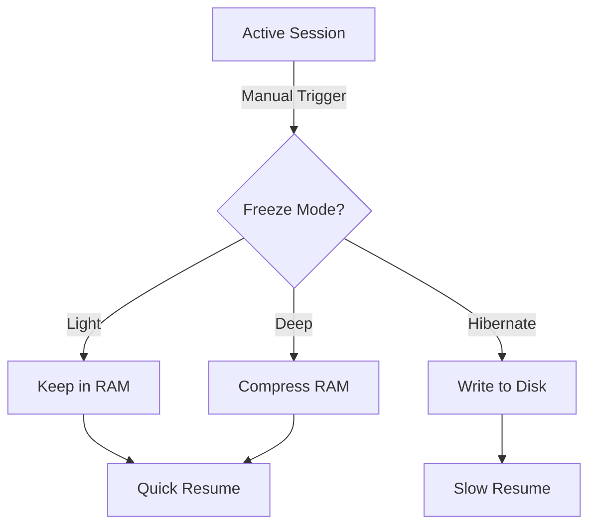

# **Principle 5: Instant Context Switching with Session Freezing**

**"The desktop environment manages self-contained workspaces that preserve complete application states, allowing instantaneous switching between different development contexts while optimizing resource usage."**

## Core Implementation

### 1. Session Definition and Management

```rust
struct DesktopSession {
    id: Uuid,
    name: String,                 // "web-dev", "mobile-dev"
    state: SessionState,          // Active/Frozen/Hibernated
    components: SessionComponents, // Apps, terminals, cards
    layout: SessionLayout,        // Window/card positions
    resource_profile: ResourceLimits,
}

enum SessionState {
    Active,
    Frozen(FrozenState),  // In-memory suspension
    Hibernated(PathBuf),  // Disk storage
}
```

### 2. Session Control CLI

```bash
# Save current workspace as session
sessionctl save web-dev --include="vscode,firefox,mysql"

# Switch sessions (auto-freezes others)
sessionctl switch mobile-dev --freeze-mode=light

# List available sessions
sessionctl list
# Output:
# web-dev (frozen) - 3 apps, 2 terminals
# mobile-dev (active) - 2 apps, 1 emulator
# backend (hibernated) - 4 services
```

## Key Features

### 1. Granular State Preservation

- **Application States**:

  - Open files and editor tabs
  - Terminal history and running processes
  - Card positions and layouts

- **System Services**:
  ```bash
  # Session hooks for database services
  hooks:
    pre-activate: "docker start postgres redis"
    post-freeze: "docker stop postgres redis"
  ```

### 2. Performance-Optimized Freezing

| Freeze Level    | Memory Usage | Restore Time | Ideal For              |
| --------------- | ------------ | ------------ | ---------------------- |
| **Light**       | 10-20%       | <100ms       | Frequent switching     |
| **Deep**        | 1-5%         | 300-500ms    | Background sessions    |
| **Hibernation** | 0%           | 2-5s         | Long-term preservation |

### 3. Visual Session Management



## Workflow Integration

### Developer Workflow Example

1. **Morning Setup**:

   ```bash
   sessionctl resume web-dev --layout=ultrawide
   ```

2. **Context Switch**:

   ```bash
   sessionctl switch mobile-dev --freeze=light
   # Instantly switches to Flutter dev environment
   ```

3. **End of Day**:
   ```bash
   sessionctl hibernate-all --compress
   # Saves all sessions to disk
   ```

## Technical Advantages

1. **CRIU Integration**:

   ```rust
   fn freeze_process(pid: Pid) -> Result<FrozenImage> {
       criu::dump(pid, "/tmp/sessions/")?;
       Ok(FrozenImage::new(pid))
   }
   ```

2. **Card System Integration**:

   - Each card remembers its parent session
   - Automatic visual dimming for frozen-session cards

3. **Resource Management**:
   ```bash
   # Set per-session resource limits
   sessionctl limit web-dev --memory=8G --cpu=4
   ```

This implementation delivers Zellij-like session management while:

- Preserving your card-based UI paradigm
- Adding granular process control
- Maintaining system-wide performance
- Supporting your specific workflow examples (web, backend, mobile contexts)

Would you like me to elaborate on any particular aspect, such as the freezing mechanism or session visualization?
