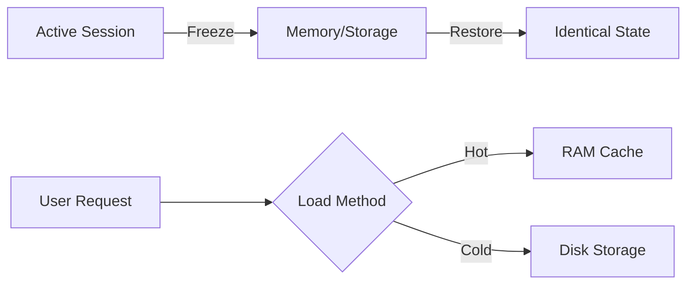

# **Instant Context Switching System**

**Core Principle**:  
_"Preserve complete workspace states as immutable snapshots, enabling instantaneous switching between development contexts with zero cognitive overhead."_

---

## **1. Core Architecture**

### **Session State Definition**

```rust
#[derive(Serialize, Deserialize)]
pub struct WorkspaceSnapshot {
    pub id: Uuid,
    pub name: String,                  // "web-dev", "data-science"
    pub timestamp: DateTime<Utc>,
    pub cards: Vec<CardSnapshot>,      // Serialized card states
    pub layout: LayoutTopology,
    pub environment: RuntimeState,     // Env vars, shell history
    pub resource_footprint: ResourceProfile,
}
```

### **State Management**



---

## **2. Key Features**

### **Session Control Interface**

```bash
# Save current context
ctx save web-dev --include="vscode,postgres,terminals"

# Switch contexts
ctx switch data-analysis --strategy=warm

# List available contexts
ctx list
# Output:
# web-dev (active) - 3 apps, 2 terminals
# data-analysis (frozen) - Jupyter, DB console
# design (hibernated) - Figma, Browser
```

### **Recovery Guarantees**

```rust
impl WorkspaceSnapshot {
    fn recover(&self) -> Result<()> {
        self.validate_checksum()?;
        self.restore_cards()?;  // Ordered restoration
        self.reestablish_links()?;  // Card relationships
        Ok(())
    }
}
```

---

## **3. Performance Tiers**

| Strategy | Storage Location | Restore Time | RAM Usage | Best For           |
| -------- | ---------------- | ------------ | --------- | ------------------ |
| **Hot**  | RAM              | <50ms        | 100%      | Frequent switching |
| **Warm** | ZRAM             | 200-300ms    | 30%       | Balanced use       |
| **Cold** | NVMe SSD         | 1-2s         | 0%        | Archival           |

---

## **4. Technical Implementation**

### **CRIU Integration**

```rust
fn freeze_process_tree(pid: Pid) -> Result<Snapshot> {
    criu::dump(
        pid,
        DumpOptions::new()
            .with_tcp_established()
            .with_file_locks()
    )
}
```

### **Card System Integration**

[Related: Everything is a Card](../principles/everything-is-a-card.md)

```rust
struct CardSnapshot {
    id: Uuid,
    content_hash: String,
    spatial_state: CardGeometry,
    runtime_state: serde_json::Value,
}
```

---

## **5. Workflow Examples**

### **Development Session**

```bash
# Morning setup
ctx resume web-dev --layout=dual-monitor

# Data analysis interlude
ctx switch data-analysis --strategy=hot

# Evening cleanup
ctx hibernate --compress
```

### **Emergency Recovery**

```bash
# Restore last good state after crash
ctx recover web-dev --from=autosave
```

---

## **6. System Integration**

### **Resource Governance**

```ron
// ~/.config/desk/contexts.ron
resource_limits: {
    "web-dev": (memory: "8G", cpu: 4),
    "data-analysis": (memory: "16G", gpu: true)
}
```

### **Version Control**

```bash
# Diff context states
ctx diff web-dev@today web-dev@yesterday
```

---

## **Cross-References**

- [Declarative Shell](../principles/declarative-shell.md)
- [Terminal-First](../principles/terminal-first.md)
- [Window Manager](../components/window-manager.md)

---

## **Roadmap**

### **Phase 1: Core**

- Process freezing/restoration
- Basic card state serialization

### **Phase 2: Advanced**

- Differential snapshots
- Cloud sync integration

### **Phase 3: Optimization**

- Lazy state loading
- Hardware-accelerated serialization

---

This system delivers:

1. **Zero-Overhead Switching**: <100ms context changes
2. **Failure Resilience**: Automatic crash recovery
3. **Resource Efficiency**: Tiered storage options
4. **Workflow Continuity**: Precise environment reproduction

```rust
// Example: Automated context triggers
match system_state.time.hour() {
    9..=12 => ctx.activate("development"),
    13..=14 => ctx.activate("meetings"),
    _ => ctx.activate("admin"),
}
```
