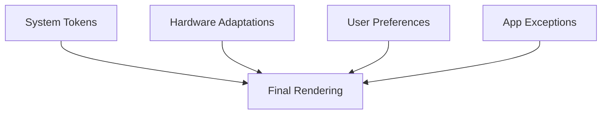

# **Design Token Consistency**

**Core Principle**:  
_"Visual and interactive properties across the desktop environment are governed by versioned, cascadable design tokens distributed as WASM modules, enabling system-wide aesthetic consistency while maintaining complete modularity of UI components."_

## **Technical Implementation**

### **1. Layered Token Architecture**

```rust
#[derive(State)]
pub struct TokenHierarchy {
    pub system: Arc<DesignTokens>,    // Base token definitions (required)
    pub hardware: DeviceTokens,       // Display-specific adaptations
    pub user: UserTokens,            // Personal preference overrides
    pub applications: AppTokenOverrides // Per-app customizations
}
```

### **2. Modular Component System**

```bash
# Replace typography engine without restart
desk tokens replace typography ./new-type-system.wasm

# Swap input handling subsystems live
desk input install ./gesture-engine.wasm
```

## **Core Innovations**

### **1. Cascading Token Resolution**



### **2. Isolated Component Architecture**

```rust
struct UIComponent {
    token_bindings: TokenMap,
    renderer: ComponentRenderer,
    #[dynamic]
    behaviors: Vec<BehaviorModule>  // Runtime-loadable
}
```

## **Performance-Sensitive Design**

### **1. GPU-Accelerated Token Processing**

```wgsl
// Token-aware shader
@group(0) @binding(0)
var<uniform> design: DesignTokens;

@fragment
fn render() -> @location(0) vec4<f32> {
    return design.colors.primary * design.elevation.current;
}
```

### **2. Differential Token Updates**

```bash
# Apply only changed token values
tokenc apply --delta ./brand-update.wasm
```

## **Key Advantages**

| Feature                | Conventional DEs            | This System               |
| ---------------------- | --------------------------- | ------------------------- |
| **Visual Consistency** | Per-widget theming          | System-wide token control |
| **Performance**        | CPU-based styling           | GPU-optimized pipeline    |
| **Flexibility**        | Monolithic codebase         | Hot-swappable modules     |
| **Maintenance**        | Breaking changes on updates | Versioned token contracts |

This principle enables:

- **Atomic design control** through centralized tokens
- **Hardware-optimized** rendering performance
- **Safe live updates** of visual subsystems
- **Enterprise-grade** version control
- **Complete modularity** without sacrificing consistency

The system achieves this through:

1. **WASM-based token modules** with strict versioning
2. **Cascading resolution** that respects hardware/user needs
3. **GPU-first rendering** of design properties
4. **Isolated component architecture** that prevents system-wide breakage

Would you like me to elaborate on the version control system or the WASM module specification details?
