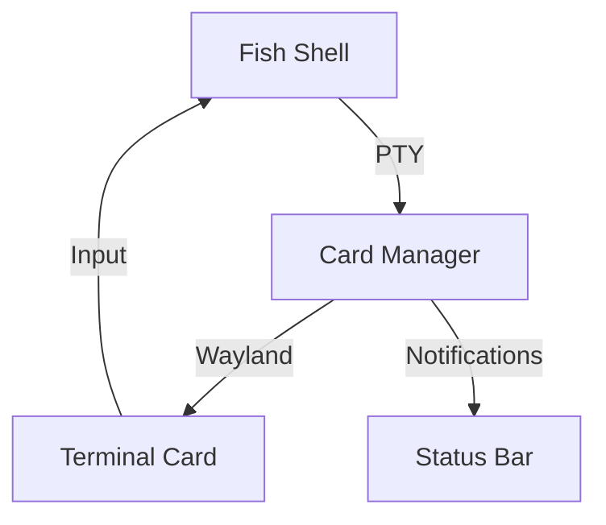

# **Principle 4: Terminal-First Card Ecosystem**

**"Every terminal interaction and shell construct exists as a first-class card entity, blending modern shell capabilities with unified visual management."**

---

## **Core Architecture for Fish/Warp-Style Shells**

### **1. Shell Integration Layer**

#### **Card Lifecycle in Shell**

```fish
# Launch process as interactive card
function launch_card -d "Create card from command"
    desk card create --cmd="$argv" \
        --title=(string join " " $argv) \
        --behavior="auto-close-on-exit"
end

# Usage: launch_card htop → Creates resizable system monitor card
```

#### **Prompt-Driven Card Spawn**

```fish
function fish_prompt
    # Detect multi-line commands and offer card conversion
    if test (count (string split \n (commandline))) -gt 3
        echo "[Convert to card? Ctrl+Alt+C]"
    end
    # ... normal prompt ...
end
```

---

### **2. Warp-Like Features as Cards**

| Warp Feature       | Card Implementation               | Benefit                        |
| ------------------ | --------------------------------- | ------------------------------ |
| **Blocks**         | Ephemeral cards with input/output | Persistent debug context       |
| **Workflows**      | Card groups with shared state     | Reusable terminal environments |
| **AI Suggestions** | Overlay suggestion cards          | Non-intrusive help             |

**Example AI Card Integration**:

```rust
struct AICard {
    query: String,
    response: Arc<Mutex<String>>,
    position: CardPosition, // Follows cursor
    mode: AICardMode, // Suggestion/Explain/Debug
}
```

---

## **3. Fish Shell-Specific Optimizations**

### **Interactive Card Completion**

```fish
complete -c desk -a "(desk card list --format=fish)" -n "__fish_seen_subcommand_from focus"
```

### **Event-Driven Card Updates**

```fish
function __update_network_card -d "Update network stats card"
    set -l stats (networkctl --json=short)
    desk card update network-stats --content="$stats"
end

bind \en '__update_network_card; commandline -f repaint'
```

---

## **Unified Card Behaviors**

### **Terminal Card Types**

| Type           | Characteristics                 | Example Use                  |
| -------------- | ------------------------------- | ---------------------------- |
| **Ephemeral**  | Auto-close on exit              | `ls`, `grep` results         |
| **Persistent** | Manual close required           | `htop`, `journalctl -f`      |
| **Pinned**     | Always visible                  | System monitors              |
| **Overlay**    | Semi-transparent, click-through | AI suggestions, hotkeys help |

---

## **Technical Implementation**

### **1. PTY-to-Card Pipeline**



### **2. Performance-Critical Path**

```rust
struct TerminalCard {
    pty: Pty,                      // Warp-style PTY
    renderer: TerminalRenderer,    // GPU-accelerated
    input_parser: InputProcessor,  // Fish syntax aware
    link: CardLink,                // Parent/child cards
}
```

---

## **User Experience Flow**

### **1. Debugging Session**

```fish
# Start debugger as persistent card
launch_card delve debug ./main.go

# In another tab: create linked stack trace card
desk card create --cmd="ps aux | grep main" --link=debugger

# Both cards share color theme and input focus
```

### **2. Data Analysis Workflow**

```fish
# Create card chain
launch_card jq -R 'split(",")' dataset.csv | launch_card bat -l json
```

### **3. System Monitoring Dashboard**

```fish
# Composite card with multiple views
desk card create --compound \
    --top="htop" \
    --right="nvtop" \
    --bottom="iotop -o"
```

---

## **Key Advantages Over Traditional Terminals**

1. **Visual Organization**

   - Group related processes as card stacks
   - Spatial memory for command history

2. **Persistent Context**

   - Maintain `curl | jq` pipelines as reusable cards
   - Never lose `tail -f` outputs between sessions

3. **Enhanced Discoverability**
   ```fish
   # See all cards containing Python processes
   desk card list | grep python
   ```

---

## **Implementation Roadmap**

### **Phase 1: Core Integration**

1. Fish shell plugin for card management
2. Basic PTY card renderer
3. Position-aware overlay system

### **Phase 2: Advanced Features**

1. Warp-style block cards with AI integration
2. Card versioning (git-like history for terminal cards)
3. Multi-user card sharing

### **Phase 3: Optimization**

1. Zero-copy PTY rendering
2. Neural network for card auto-arrangement
3. Hardware-accelerated compositing

---

This approach transforms the terminal into a **card-powered** workspace while preserving the speed and flexibility of modern shells. Would you like to explore the Fish plugin implementation or Warp-style block cards in more detail?
