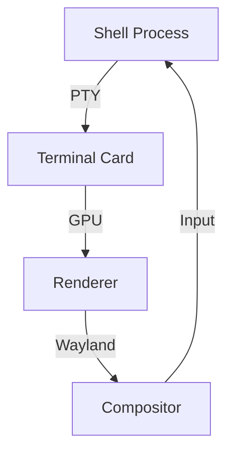

# **Terminal-First Card System**

**Core Principle**:  
_"Treat terminal sessions as first-class card citizens, blending shell productivity with visual card management while maintaining full CLI compatibility."_

---

## **1. Core Architecture**

### **Terminal Card Type**

```rust
#[derive(State)]
pub struct TerminalCard {
    pub pid: u32,                   // Process ID
    pub pty: PtyHandle,             // Warp-style PTY
    pub title: String,              // Dynamic title
    pub working_dir: PathBuf,       // Current directory
    pub shell: ShellType,           // Fish/Zsh/Bash
    #[observed]
    pub state: TerminalState,       // Running/Finished
    pub behavior: TerminalBehavior, // Auto-close, Persistent
}
```

### **Shell Integration (Fish Example)**

```fish
function fish_prompt
    # Auto-register terminal as card
    if not desk card exists term-$fish_pid
        desk card create term-$fish_pid \
            --type=terminal \
            --cmd="fish" \
            --cwd=(pwd) \
            --title="Terminal"
    end
    # ... normal prompt ...
end
```

---

## **2. Key Features**

### **Terminal Card Types**

| Type           | Characteristics            | Example Use          |
| -------------- | -------------------------- | -------------------- |
| **Ephemeral**  | Auto-close on exit         | `grep`, `ls` results |
| **Persistent** | Manual close required      | `htop`, `journalctl` |
| **Pinned**     | Always visible in sidebar  | System monitors      |
| **Overlay**    | Click-through transparency | Documentation viewer |

### **Warp-Style Blocks as Cards**

```rust
struct CommandBlock {
    input: String,
    output: Vec<u8>,
    exit_code: Option<i32>,
    card_id: Uuid,
}
```

---

## **3. Performance-Sensitive Components**

### **PTY Rendering Pipeline**



### **Terminal Renderer**

```rust
struct TerminalRenderer {
    glyph_cache: GpuGlyphCache,
    damage_regions: Vec<Rect>,
    parser: VtParser,
    link_semantics: LinkDetection,
}
```

---

## **4. Shell-Specific Optimizations**

### **Fish Shell Integration**

```fish
# Auto-convert long commands to cards
function __fish_long_command_notify
    if test (count $argv) -gt 5
        desk card create --cmd="$argv" --title="Command: $argv[1]"
    end
end
```

### **Zsh/Bash Compatibility**

```bash
# Bash PROMPT_COMMAND equivalent
trap 'desk card update term-$$ --cwd="$PWD"' DEBUG
```

---

## **5. Advanced Interactions**

### **Card-Enhanced Workflows**

```fish
# Create linked cards for debugging
launch_card lldb ./target/debug/myapp | \
    launch_card --linked htop --filter=myapp
```

### **AI Integration**

```rust
struct AITerminalCard {
    query: String,
    response: Arc<Mutex<String>>,
    position: CardPosition, // Follows cursor
    mode: AICardMode,      // Explain/Debug/Suggest
}
```

---

## **6. System Integration**

### **Process Management**

```rust
impl TerminalCard {
    fn terminate(&self) {
        nix::sys::signal::kill(
            Pid::from_raw(self.pid),
            Signal::SIGTERM
        )?;
        self.state = TerminalState::Finished;
    }
}
```

### **Resource Monitoring**

```bash
# Card-resource usage
desk card stats term-1234 --format=json
```

---

## **Cross-References**

- [Everything is a Card](../principles/everything-is-a-card.md)
- [Declarative Shell](../principles/declarative-shell.md)
- [Rust API](../api/rust-api.md)

---

## **Roadmap**

### **Phase 1: Core**

- Basic PTY card rendering
- Fish/Zsh integration hooks

### **Phase 2: Advanced**

- Warp-style block cards
- Neural command prediction

### **Phase 3: Optimization**

- Zero-copy PTY rendering
- Hardware-accelerated text

---

This system combines the efficiency of terminal workflows with the visual organization of cards, delivering:

1. **Context Preservation**: Never lose running processes
2. **Visual Debugging**: Linked monitoring cards
3. **Natural Discovery**: `desk card list | grep python`
4. **Performance**: GPU-accelerated rendering
